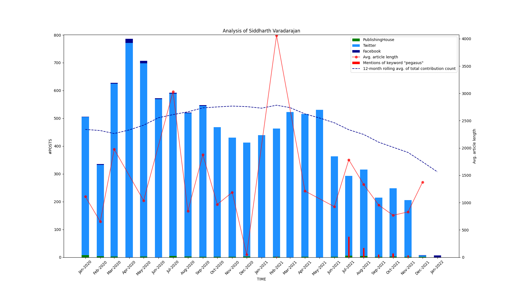

# The Pegasus Effect

## Introduction

Pegasus is a smartphone spyware developed by the Israeli technological firm NSO group. The Citizen Lab described it as the "most sophisticated cyber weapon ever discovered". 

In 2020, around 50,000 phone numbers believed to have been victims of Pegasus surveillance were leaked to the French NGO Forbidden Stories. A team of journalists began investigating these numbers.

It was found that the list contained opposition politicians, activists and around 200 journalists from nearly two dozen countries along with 14 head of states. Pegasus has also been linked to the murder of Saudi journalist [Jamal Khashoggi](https://www.amnesty.org/en/latest/press-release/2021/07/the-pegasus-project/).

As part of the revelations, Forbidden Stories posted detailed profiles of 44 victims of Pegasus on their website. Our project is focused on these 44 individuals. We visualized how Pegasus victims reacted to the fact that they were being spied upon by analyzing their online activity.

## Methodology

For each journalist, the timeline of their targeting with Pegasus was described on Forbidden Stories. 

We hence collected activity data for all journalists in the appropriate time period from three sources: Twitter, Facebook and their main media outlet(s). The latter was usually a newspaper website, but could also be a blog or some other type of dedicated online presence. 

As a sample, the graph generated for Indian journalist Siddharth Varadarajan is show below - 

## Results
Including Siddharth Varadarajan, 7/44 journalists' online activity showed extreme variance right after they found out they were being spied on using Pegasus. These journalists were - Carlos Ketohou, Lenaïg Bredoux, Sushant Singh, Ferdinand Ayité, Taoufik Bouachrine, Vijaita Singh, Siddharth Varadarajan.

## Final report
The final report for this project can be found [here](https://github.com/kumaravelrajan/thePegasusEffect/blob/main/Investigating_Pegasus_Impact_on_the_Online_Activity_of_Journalists_Targeted_with_Illegal_Surveillance_-_an_open-source_data_analysis.pdf). 